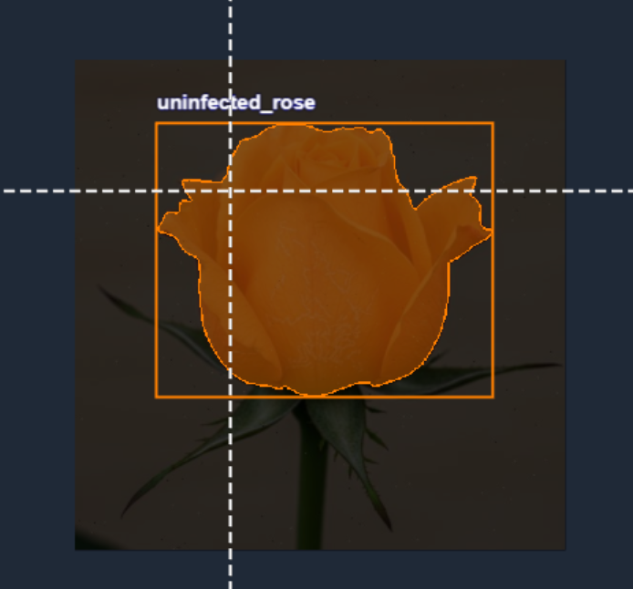
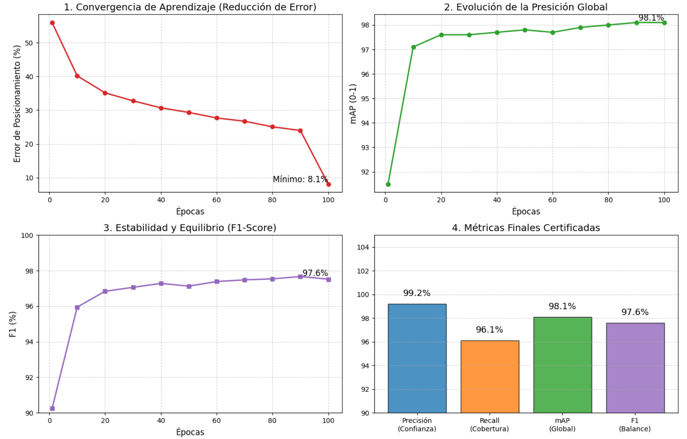
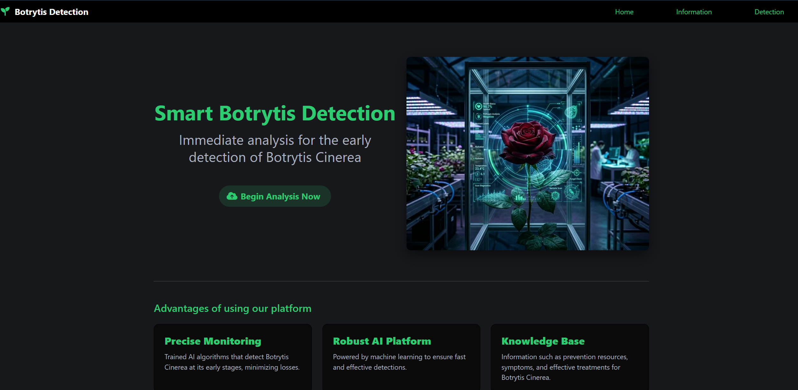
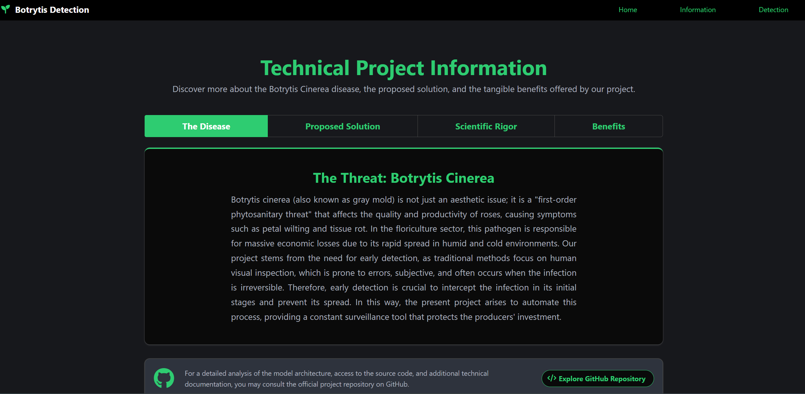
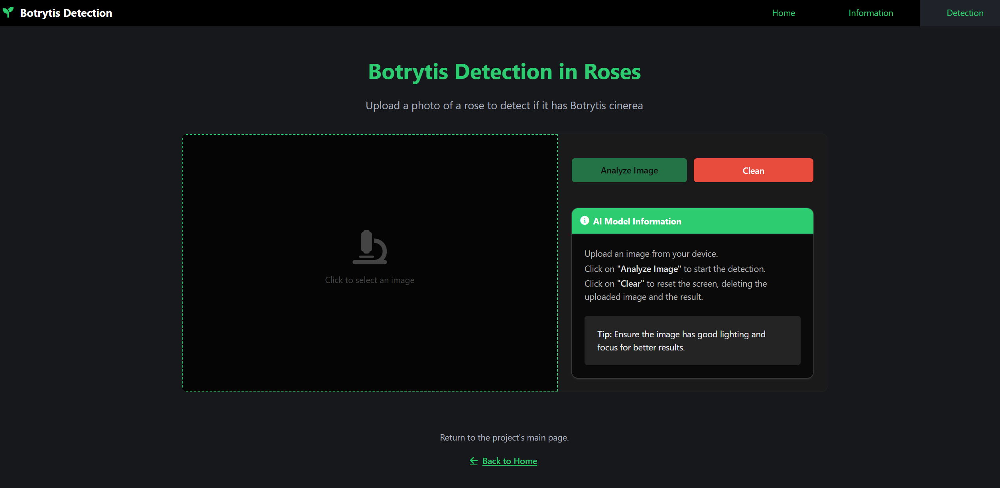
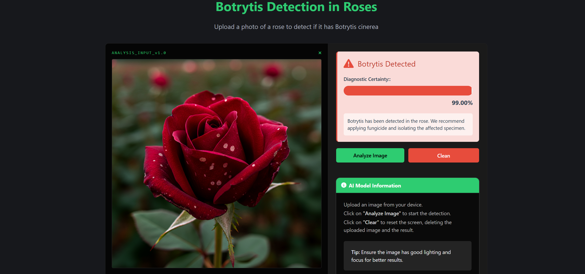

<div align="center">
  <!-- TODO: Replace with your own banner if desired -->
  

  # 🌹 Botrytis Detection System
  
  **An AI-powered computer vision system for real-time detection of Botrytis cinerea in roses.**

  [](#)
  [](#)
  [](#)
  [](#)
</div>

<br />

## 📖 About The Project

This project was developed as a Computer Science Thesis at Universidad Internacional del Ecuador (UIDE) and has evolved into a robust showcase of full-stack AI integration. 

It tackles a "first-order phytosanitary threat" in the floriculture sector: *Botrytis cinerea* (gray mold) in rose crops. This pathogen is responsible for massive economic losses due to its rapid spread in humid and cold environments. Traditional methods focus on human visual inspection, which is prone to errors and subjectivity. 

Our solution provides a **full-stack web application** integrated with a **Deep Learning computer vision model** to automatically analyze images of roses and detect early signs of Botrytis infection. This automates the diagnostic process, providing farmers and agricultural engineers with a constant surveillance tool that protects their investment.

### ✨ Key Features

- **Real-Time Analysis**: Upload images of roses and get immediate inference results.
- **High Accuracy Detection**: Powered by a custom-trained Ultralytics YOLOv8 medium model.
- **Intuitive Web Interface**: Built with React and Bulma for a responsive, modern, and dark-mode friendly user experience.
- **RESTful API**: A robust Python FastAPI backend that can be integrated with other agricultural systems.

---

## 🏗️ Architecture & Tech Stack

### Frontend
- **Framework**: [React.js](https://reactjs.org/)
- **Styling**: [Bulma](https://bulma.io/) CSS framework (with dark mode support)
- **State Management & Routing**: Redux Toolkit & React Router
- **Icons**: FontAwesome & React Icons

### Backend
- **Framework**: [FastAPI](https://fastapi.tiangolo.com/) (Python)
- **Image Processing**: Pillow (PIL)
- **Server**: Uvicorn

### Machine Learning
- **Model**: [YOLOv8m](https://docs.ultralytics.com/) (Ultralytics)
- **Classes**: `botrytis_rose`, `uninfected_rose`
- **Training Env**: Built to run locally or on Google Colab (`train_yolo.py` / `train_yolo_colab.ipynb`)

---

## 📸 Dataset & Model Training

The model was trained using a custom dataset annotated via Roboflow. Below are examples of the annotations and the progression of the model's learning phase during training.

### Image Annotation (Roboflow)
| Uninfected Rose | Botrytis Rose |
| :---: | :---: |
|  |  |

### Training Metrics (YOLOv8)
The model achieved a high confidence rate across multiple validation metrics:
<div align="center">
  
</div>

---

## 🖥️ Application UI & Demo

Our platform provides an intuitive and responsive dark-mode interface for both learning and real-time detection.

### Dashboard & Technical Information
| Home Dashboard | Scientific Knowledge Base |
| :---: | :---: |
|  |  |

### Real-Time AI Inference
| Upload Interface | Live Analysis Result |
| :---: | :---: |
|  |  |

---

## 🚀 Getting Started

Follow these instructions to set up the project locally.

### Prerequisites

- **Node.js** (v14+ recommended)
- **Python** (v3.9+ recommended)
- **Yarn** or **npm**

### 1. Backend Setup

1. Navigate to the backend directory:
   ```bash
   cd backend
   ```
2. Create and activate a virtual environment:
   ```powershell
   python -m venv .venv
   .\.venv\Scripts\Activate.ps1  # Windows
   # source .venv/bin/activate   # Linux/Mac
   ```
3. Install dependencies:
   ```bash
   pip install -r requirements.txt
   ```
4. Start the FastAPI server:
   ```bash
   cd app
   uvicorn main:app --reload --host 0.0.0.0 --port 8000
   ```

### 2. Frontend Setup

1. Open a new terminal and navigate to the frontend directory:
   ```bash
   cd frontend
   ```
2. Install dependencies:
   ```bash
   npm install
   # or yarn install
   ```
3. Start the React development server:
   ```bash
   npm start
   # or yarn start
   ```

*(The application should now be running at `http://localhost:3000`)*

---

## 🧠 Model Training (Optional)

If you wish to retrain the YOLOv8 model with new data:

1. Navigate to `training_workspace`.
2. Ensure your dataset is formatted in YOLO format inside the `dataset/` folder.
3. Run the training script:
   ```bash
   python train_yolo.py
   ```
   *(This script will automatically generate a 20% validation split and train a YOLOv8m model for 100 epochs).*
4. Alternatively, use `train_yolo_colab.ipynb` for GPU acceleration on Google Colab.

---

## 👥 Authors / Team Members

- **Steven Andrés Guamán Figueroa**
- **Jonathan Santiago Almeida Salas**

---
*Developed as a Thesis Project for Universidad Internacional del Ecuador (UIDE), now expanded into an open source portfolio project.*